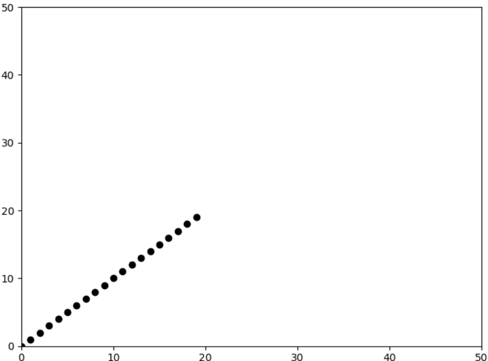
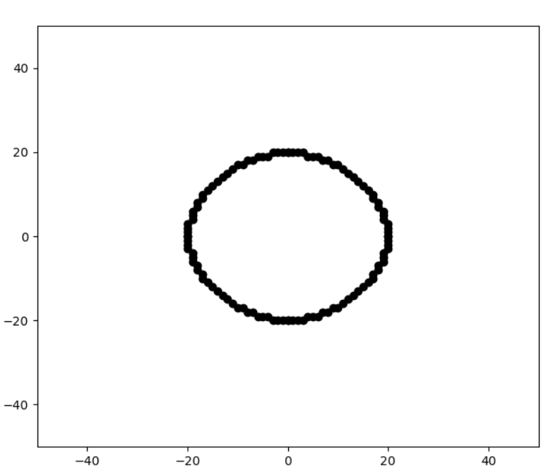

# KG1
lab1, Hryshkin

## Task

Create a (web) app allowing the user to choose and interactively change the color and showing its components in three 
color models (RGB, XYZ, LAB) in real time.

## Result

Linear Bresenham's algorithm is the fastest  

Figure 1

Figure 2

Figure 3

Figure 4

## Requirements

* win10 latest version

## Installation and usage

Run app.exe